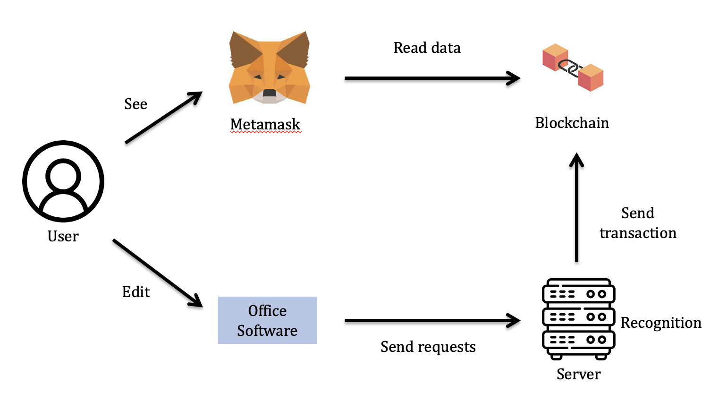
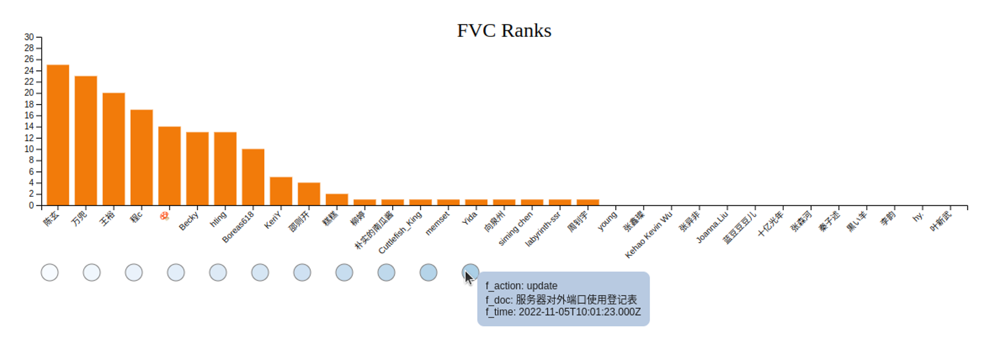

# Points and Incentive Scheme Based on Private Blockchain

## Introduction

* Record the contributions of each team member and quantify their contributions to points;

* Convert points as ERC-20 tokens on Ethereum's testnet Goerli;

* Automatic implementation task listening, point issuing, and visual display, so that members will view the growth of their points  in real-time.

## Solution Details

* Smart Contracts: The points system is based on the ERC-20 standard and prohibits transactions; the digital badge system is based on EIP-5484: Consensual Soulbound Tokens;

* Office software: Sending HTTP requests to the server after updating (publishing or updating documents, commenting, and replying correspond to different points) using Webhook;

* Backend: Recognizing the request, calculates the points, and invokes the on-chain contract to issue the corresponding points to the students;

* Frontend: Visualizing points with ranking.

